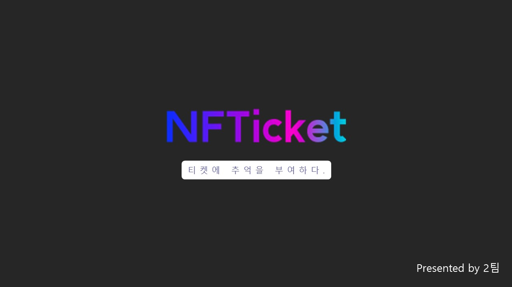
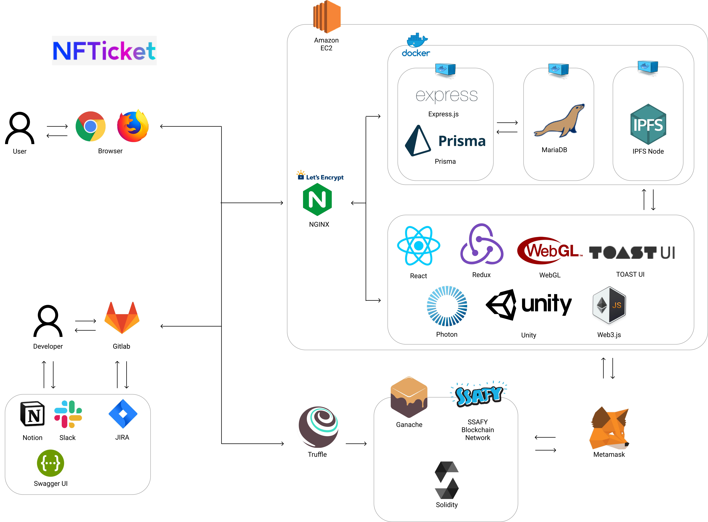
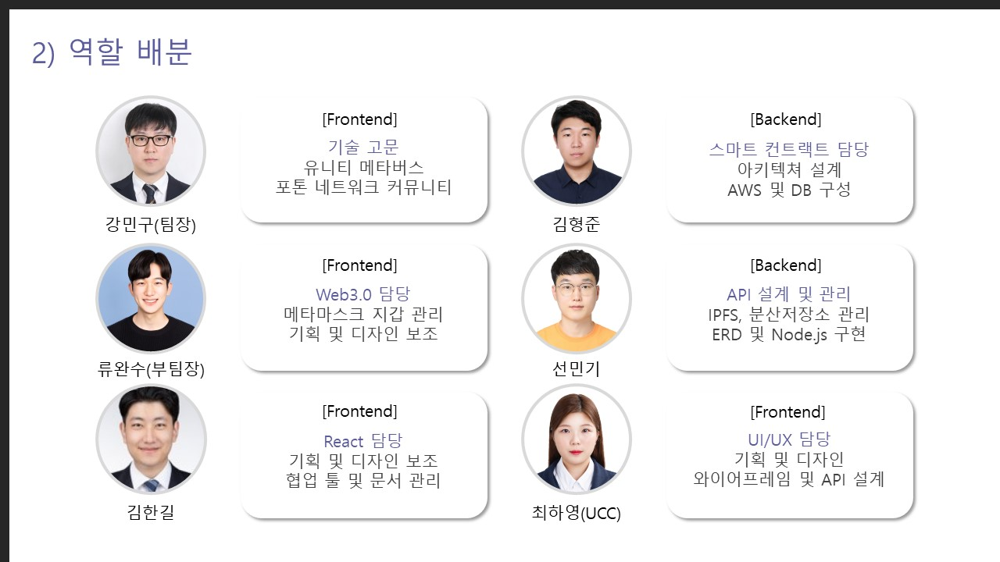
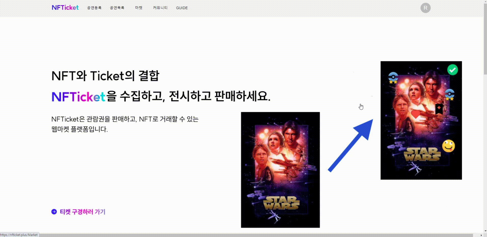
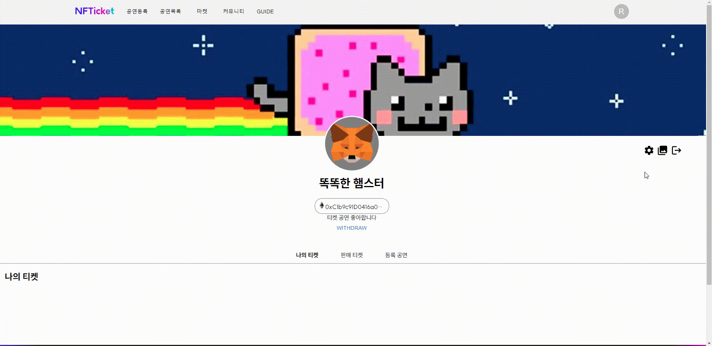
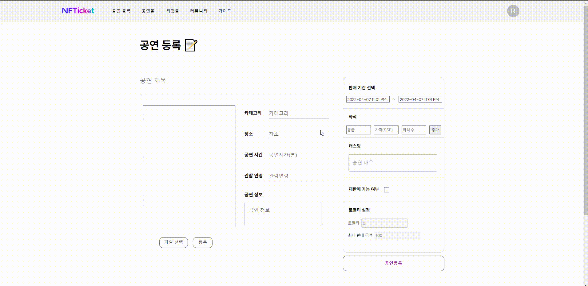
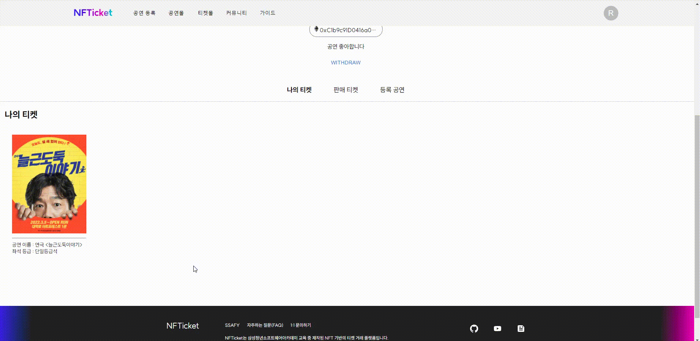

# 🐢 NFTicket - 티켓의 추억을 부여하다




## NFTicket 링크(PC 화면) : [https://nfticket.plus](https://nfticket.plus/)
## 소개 영상 보기 : [UCC 링크](https://youtu.be/WU3tIIOS0Ec) [수정필요]

## 💜 프로젝트 진행 기간
2022.02.21(월) ~ 2022.04.08(금) (46일간 진행)  
SSAFY 6기 2학기 블록체인 특화 프로젝트 - NFTicket

</br>

## 🎵 NFTicket - 배경
공연이 끝난 뒤, 누군가와의 혹은 그 순간 나만의 소중한 추억이 담긴 티켓이 사라지는 것이 아쉽지 않으셨나요? 모아두고 싶어도 아름답지 않아 결국 사라지는 추억들.

수집가처럼 앨범을 준비하고 일상을 기록하기는 힘들지만 마음만큼은, 그 순간의 추억을 간직하고 싶은 당신을 위해 준비했습니다.
</br>

## 💜 NFTicket - 개요 [수정필요]
*- 당신의 추억의 조각을 기록하고 소유할 수 있도록 -*  

**NFTicket**은 당신의 추억이 담긴 티켓을 기록하고 소유할 수 있는 NFT로 만들어 드리는 NFT 기반 블록체인 티켓 거래 시스템입니다.

블록체인 기술을 이용해 대체 불가능 한 나만의 티켓을 만들고, 추억을 담아, 소유할 수 있는 NFT 기반 티켓 예매 및 거래 서비스를 제공합니다.

나에게 특별한 가치가 있는 티켓, 나만의 개성을 담은 티켓을 만들어 다른 사람에게 뽐낼 수 있는 커뮤니티 기능을 제공합니다.

특별한 추억이 담긴 티켓을 거래함으로써 그 가치를 증명하고 인기 있는 티켓을 수집하고 소유 할 수 있습니다.
</br>

## 💜 주요 기능 [수정필요]
---
- ### 공연 관리
    - 블록체인 기반의 안전한 공연 관리 시스템을 통해 당신의 공연을 등록해 보세요
    - 공연 기획이 부담스러운 인디 뮤지션들도 수수료 걱정 없이 공정하고 투명한 플랫폼에서 공연 정보와 일정을 관리할 수 있습니다.
    - 인기 있는 공연의 골칫거리 "암표", NFTicket에서 암표를 추적하고 리셀 정책을 설정하여 건전한 리셀 시장을 형성할 수 있습니다.
    <br/>
- ### 공연 예매
    - 블록체인을 통해 공연을 예매하고, 당신의 티켓을 소장해보세요.
    - 스마트 컨트랙트를 통해 중개 시스템(Middle-man) 없이도 정당하게 나의 티켓을 예매할 수 있습니다.
    - 비대면 온라인 공연 등에도 블록체인 네트워크를 통해 티켓을 소유한 사람만 접속하도록 할 수 있습니다.
    <br/>
- ### 티켓 꾸미기
    - 공연이 끝난 뒤에도 사라지지 않고 당신의 추억을 담은 메세지나 스티커를 붙여 나만의 티켓을 만들 수 있습니다.
    <br/>
- ### 스마트 컨트랙트에서 거래
    - 이더리움 네트워크 내 스마트 컨트랙트를 통해 NFT 토큰(티켓) 거래
    - middle-man에 대한 의존성 제거
    - 이더리움 네트워크 내 참여 노드들에 의해 거래 검증
</br>

## ✔ 주요 기술
---

**Backend - Express.js**
- Visual Studio Code
- Node.ks 16.14
- PRISMA 2
- ethers 5.6.2
- dotenv
- morgan
- winston
- MariaDB

**BlockChain - Ethereum**
- Solidity 0.4.22 < 0.9.0
- openzeppelin/contracts
- Truffle

**Storage**
- IPFS
- IPFS-Cluster

**Frontend  [수정 필요]**
- Visual Studio Code IDE
- Vue 2.6.11
- Vuetify 2.4.0
- Vuex 3.4.0
- Webstomp-Client 1.2.6
- Sock.js-Client 1.5.2
- Firebase 9.6.6
- sweetalert2 11.3.10

**CI/CD**
- AWS EC2
- Jenkins
- NGINX
- SSL
- Docker
- Portainer

## ✔ 프로젝트 구조
---


## ✔ 프로젝트 파일 구조
---
### Frontend

```
Frontend
├── README.md
├── package.json
├── public
│   ├── build
│   │   ├── 02.Gallery.data
│   │   ├── 02.Gallery.framework.js
│   │   ├── 02.Gallery.loader.js
│   │   └── 02.Gallery.wasm
│   ├── favicon-1.ico
│   ├── favicon-2.ico
│   ├── favicon.ico
│   ├── images
│   │   ├── 1.png
│   │   ├── ...
│   │   └── ticketImg5.png
│   ├── index.html
│   ├── logo192.png
│   ├── logo512.png
│   ├── manifest.json
│   └── robots.txt
├── src
│   ├── App.css
│   ├── App.js
│   ├── components
│   │   ├── AnimalCard.js
│   │   ├── CreateImage.js
│   │   ├── DatepickerComponent.js
│   │   ├── Footer.js
│   │   ├── Home
│   │   │   ├── Community.js
│   │   │   ├── CommunityItem.js
│   │   │   ├── Home.css
│   │   │   ├── HomeShow.js
│   │   │   ├── HomeTicket.js
│   │   │   ├── Perform.js
│   │   │   ├── PerformShow.js
│   │   │   ├── PerformTicket.js
│   │   │   ├── Slider.css
│   │   │   ├── Slider.js
│   │   │   ├── SpecialTicket.js
│   │   │   ├── Ticket.js
│   │   │   ├── Ticketo.js
│   │   │   ├── TicketoItem.js
│   │   │   └── TodayPerformance.js
│   │   ├── InputEditor.js
│   │   ├── InputItem.js
│   │   ├── InputList.js
│   │   ├── MyAnimalCard.js
│   │   ├── MyPage
│   │   │   ├── MyShow.js
│   │   │   ├── MyTicket.js
│   │   │   ├── MyTicketItem.js
│   │   │   ├── SellTicket.js
│   │   │   ├── TicketOnSale.js
│   │   │   └── Tmp.js
│   │   ├── Navbar.css
│   │   ├── Navbar.js
│   │   ├── Perform3.js
│   │   ├── PosterImage.js
│   │   ├── ProfileImage.js
│   │   ├── Purchase
│   │   │   ├── Seat.css
│   │   │   ├── Seat.js
│   │   │   ├── SeatInfo.js
│   │   │   ├── SeatInfomation.js
│   │   │   ├── SeatItem.js
│   │   │   └── SeatLine.js
│   │   ├── SaleAnimalCard.js
│   │   ├── Settings.js
│   │   ├── ShowDetail
│   │   │   ├── TopLeft.css
│   │   │   ├── TopLeft.js
│   │   │   └── TopRight.js
│   │   ├── ShowList.js
│   │   ├── ShowPublish
│   │   │   ├── InputEditor.js
│   │   │   ├── InputItem.js
│   │   │   └── InputList.js
│   │   ├── TicketCollection.js
│   │   ├── TicketDetail
│   │   │   ├── Bottom.js
│   │   │   ├── Middle.js
│   │   │   ├── MiddleLeft.js
│   │   │   ├── MiddleRight.js
│   │   │   ├── NFTInfo.js
│   │   │   ├── Notification.js
│   │   │   ├── PurchaseTicket.js
│   │   │   ├── TicketImage.js
│   │   │   ├── TicketInfo.js
│   │   │   ├── TopLeft.css
│   │   │   ├── TopLeft.js
│   │   │   ├── TopRight.js
│   │   │   └── TradeHistory.js
│   │   ├── TicketDetailHandover
│   │   │   ├── Bottom.js
│   │   │   ├── Middle.js
│   │   │   ├── MiddleLeft.js
│   │   │   ├── MiddleRight.js
│   │   │   ├── OtherTicketInfo.js
│   │   │   ├── Top.js
│   │   │   ├── TopLeft.js
│   │   │   └── TopRight.js
│   │   ├── TicketSale.js
│   │   ├── TradeTicket.js
│   │   ├── common
│   │   │   └── ScrollToTop.js
│   │   ├── guide
│   │   │   ├── GuideBody.js
│   │   │   ├── GuideBodyComponent.css
│   │   │   ├── GuideBodyComponent.js
│   │   │   ├── GuideHeader.css
│   │   │   ├── GuideHeader.js
│   │   │   ├── GuideTitle.css
│   │   │   └── GuideTitle.js
│   │   └── toast
│   │       └── DrawerMain.js
│   ├── images
│   │   ├── logo.png
│   │   └── stamp
│   │       ├── emoticon
│   │       │   ├── 01_really.png
│   │       │   ├── ...
│   │       │   └── 24_suspicious.png
│   │       ├── family
│   │       │   ├── 001.png
│   │       │   ├── ...
│   │       │   ├── 010.png
│   │       │   └── readme.txt
│   │       ├── galaxy
│   │       │   ├── 001.png
│   │       │   ├── ...
│   │       │   ├── 015.png
│   │       │   └── readme.txt
│   │       ├── icon
│   │       │   ├── 001.PNG
│   │       │   ├── ...
│   │       │   └── 048.PNG
│   │       ├── normal
│   │       │   ├── 001.png
│   │       │   ├── ...
│   │       │   ├── 120.png
│   │       │   └── readme.txt
│   │       ├── pin
│   │       │   ├── 001.png
│   │       │   ├── ...
│   │       │   ├── 032.png
│   │       │   └── readme.txt
│   │       ├── sns
│   │       │   ├── 001.png
│   │       │   ├── ...
│   │       │   ├── 068.png
│   │       │   └── readme.txt
│   │       ├── stamp1.png
│   │       ├── ...
│   │       └── stamp7.png
│   ├── index.css
│   ├── index.js
│   ├── pages
│   │   ├── Community.js
│   │   ├── Decorate.js
│   │   ├── Detail.js
│   │   ├── Guide.js
│   │   ├── Home.js
│   │   ├── Market.js
│   │   ├── Mint.js
│   │   ├── MyAnimal.js
│   │   ├── MyPage.js
│   │   ├── MyTicket.js
│   │   ├── NotFound.js
│   │   ├── Page1.js
│   │   ├── Page2.js
│   │   ├── Page4.js
│   │   ├── Payment.js
│   │   ├── Profile.js
│   │   ├── Purchase.js
│   │   ├── SaleAnimal.js
│   │   ├── ScheduleManager.js
│   │   ├── SelectSeat.js
│   │   ├── Show.js
│   │   ├── ShowDetail.js
│   │   ├── ShowPublish.js
│   │   ├── Thumbnail.css
│   │   ├── TicketDetail.css
│   │   ├── TicketDetail.js
│   │   ├── TicketDetail2.js
│   │   ├── TicketDetailHandover.js
│   │   ├── TicketPurchase.js
│   │   └── TicketPurchaseDetail.js
│   ├── store
│   │   ├── GuidePageReducer.js
│   │   ├── MushmomReducer.js
│   │   ├── WalletReducer.js
│   │   └── store.js
│   └── utils
│       ├── web3.js
│       └── web3Config.js
└── yarn.lock
```

### Backend

```
NFTicket
├── README.md
├── api
│   └── swagger.json
├── app.js
├── package-lock.json
├── package.json
├── prisma
│   └── schema.prisma
├── public
│   ├── favicon.ico
│   └── stylesheets
│       └── main.css
├── routes
│   ├── controllers
│   │   ├── account.js
│   │   ├── block.js
│   │   ├── profile.js
│   │   ├── role.js
│   │   ├── sale.js
│   │   ├── show.js
│   │   └── staff.js
│   └── index.js
├── services
│   ├── address.js
│   ├── auth.js
│   ├── block.js
│   ├── profile.js
│   ├── role.js
│   ├── sale.js
│   ├── show.js
│   └── staff.js
├── start.sh
└── utils
    ├── prisma.js
    ├── swagger.js
    └── winston.js
```
### BlockChain
```
NFTicket
├── README.md
├── contracts
│   ├── IResellPolicy.sol
│   ├── ITicketClass.sol
│   ├── Migrations.sol
│   ├── MyTicket.sol
│   ├── ShowSchedule.sol
│   ├── ShowScheduleManager.sol
│   ├── SsafyToken.sol
│   ├── TicketSale.sol
│   └── TicketSaleManager.sol
├── migrations
│   └── 1_initial_migration.js
├── package.json
└── truffle-config.js

```

## ✔ 협업 툴
---
- Gitlab
- Notion
- Gether Town
- JIRA
- Slack
- MatterMost
- Webex
- Code With Me
- Visual Studio Live Share
- Swagger

## ✔ 협업 환경
---
- Gitlab
  - 코드 버전 관리
  - 이슈 발행, 해결을 위한 토론
  - MR시, 팀원이 코드리뷰를 진행하고 피드백 게시
- JIRA
  - 매주 목표량을 설정하여 Sprint 진행
  - 업무의 할당량을 정하여 Story Point를 설정하고, In-Progress -> Done 순으로 작업
  - 소멸 차트를 통해 프로젝트 진행도 확인
- 회의
  - Gether Town 아침회의 진행, 전날 목표 달성량과 당일 할 업무 브리핑
  - 각자 위치에서 건네야 할 말이 생기면 팀원의 위치로 이동하여 전달
  - 빠른 소통과 신속한 대응 가능
- Notion
  - 회의가 있을때마다 회의록을 기록하여 보관
  - 회의가 길어지지 않도록 다음날 제시할 안건을 미리 기록
  - 기술확보 시, 다른 팀원들도 추후 따라할 수 있도록 보기 쉽게 작업 순서대로 정리
  - 컨벤션 정리
  - 간트차트 관리
  - 스토리보드, 스퀀스다이어그램, 기능명세서 등 모두가 공유해야 하는 문서 관리
- Slack
  - 현재 작업 상황 공유
  - 기능 수정 공지
  - 투표 진행
- Visual Studio Live Share
  - 실시간으로 의사소통하며 받으며 함께 코딩
  - 피드백의 빠른 반영 가능
  - 집단지성을 이용해 코드의 신뢰성과 작업속도 향상

## ✔ 팀원 역할 분배
---


## ✔ 프로젝트 산출물 [수정 필요]
---
- [기능명세서](docs/docs/기능명세서.md)
- [디자인&컨셉기획](./docs/디자인&컨셉기획.md) [수정 필요]
- [스토리보드](./docs/스토리보드.md) [수정 필요]
- [플로우차트](./docs/docs/플로우차트.md)
- [아키텍처](docs/docs/아키텍처.md)
- [와이어프레임](docs/docs/와이어프레임.md)
- [컨벤션](docs/docs/컨벤션.md)
- [API](docs/docs/apidocs.pdf)
- [ERD](docs/docs/ERD.md)
- [회의록](docs/docs/회의록.md)
- [시스템기술서](docs/docs/NFTicket_시스템_기술서.pdf)
- [명세기술서](./docs/TUPLI_명세_기술서.docx) [수정 필요]

## ✔ 프로젝트 결과물 [수정 필요]
- [포팅메뉴얼](./exec/TUPLI_포팅_메뉴얼.docx) [수정 필요]
- [중간발표자료](docs/docs/NFTicket_midterm.pdf)
- [최종발표자료](docs/docs/NFTicket - 최종.pdf)


## 🎵 NFTicket 서비스 화면 [수정 필요]
---

### 메인화면
- 캐로셀이 적용된 배너
- 판매 중이 공연 티켓 페이지 나열
- 개인간 거래 중인 공연 티켓 전시


### 로그인
- 메타마스크 지갑주소를 사용해 로그인합니다.
- 처음 접속하는 지갑주소인 경우, 임의로 설정된 닉네임, 자기소개, 프로필사진이 부여됩니다.



### 프로필 변경 [수정 필요]
- 프로필을 변경 전, 지갑 소유자가 맞는지 확인하는 인증 절차를 거쳐야합니다. 
- 닉네임, 프로필 사진, 자기소개를 변경 할 수 있습니다.



### 공연 등록
- 공연명, 공연 장소, 공연 시간, 관람제한 연령, 공연설명, 포스터 이미지 등을 입력받아 공연을 등록합니다.



### 공연 티켓 판매 페이지
- 현재 진행 중인 공연에 대한 상세정보와 출연진을 확인할 수 있습니다.
- 공연명, 공연장소, 판매기간, 공연시간, 관렴연령, 가격 등 공연에 관한 정보를 확인 할 수 있습니다.
- 티켓 예매 페이지와 연결되는 링크를 제공합니다.


### 티켓 예매
- 원하는 좌석, 원하는 날짜를 선택하고 티켓을 구매합니다.


### 티켓 꾸미기 [수정 필요]
- 최신순으로 업로드된 플레이리스트 or 플레이룸 or 게시글 정보를 로드합니다.
- 무한스크롤이 적용됩니다.


### 티켓 재판매글 등록
- 보유한 티켓 중 하나를 재판매합니다.
- 재판매 유효시간, 재판매 가격 등을 입력받습니다.



### 티켓 재판매 [수정 필요]
- 최신순으로 업로드된 플레이리스트 or 플레이룸 or 게시글 정보를 로드합니다.
- 무한스크롤이 적용됩니다.


### 커뮤니티 [수정 필요]
- 최신순으로 업로드된 플레이리스트 or 플레이룸 or 게시글 정보를 로드합니다.
- 무한스크롤이 적용됩니다.


