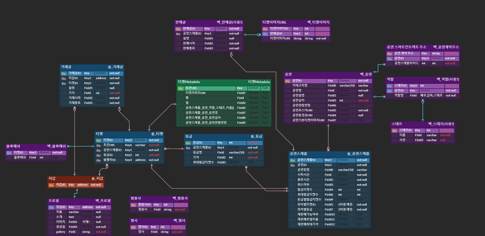

# ERD

### 스마트 컨트랙트 구조와 웹 서버 데이터 베이스의 관계를 ER 다이어그램으로 표현하였습니다. 

## 다이어그램 설명
### 티켓
- 발급 받은 티켓
- 티켓의 실제 내용을 가리키는 메타데이터 주소 저장
- 좌석 등급, 발행자 ID, 공연 스케줄 ID 존재
### 거래글
- 티켓을 판매하는 스마트 컨트랙트
- 티켓 가격, 거래시작, 거래종료 포함
### 공연스케줄
- 공연 정보 등록과 티켓을 발급하는 역할
- 좌석별, 등급별로 발급하는 티켓의 수가 상이함
- 재판매 로열티, 재판매 최대가격 존재
### 등급
- 좌석의 등급을 표시
- 등급에 따라 좌석의 가격과 최대 발급 티켓수가 다름
### 지갑
- 사용자의 지갑주소
### 프로필
- 사용자의 이름, 소개, 이미지, 생성일, 갤러리 크기를 저장
- 지갑주소로 로그인하여 수정, 생성
### 판매글
- 공연 티켓을 판매하는 게시글
- 티켓 판매시간, 종료시간, 공연 정보 등을 포함
### 티켓이미지URL
- 판매글에서 사용할 티켓 이미지 저장
### 공연
- 공연의 정보 저장
- 공연명, 공연길이, 관람연령 스태프, 배우 등을 저장
### 공연 스마트컨트랙트 주소
- 블록체인에 등록된 공연의 스마트컨트랙트의 주소를 저장
### 역할
- 공연에 참여한 스태프의 역할 명시
### 스태프
- 공연에 참여한 사람 명시
### 형용사
- 최초 로그인시 임시 닉네임을 만드는 데 사용
### 명사
- 최초 로그인시 임시 닉네임을 만드는 데 사용
