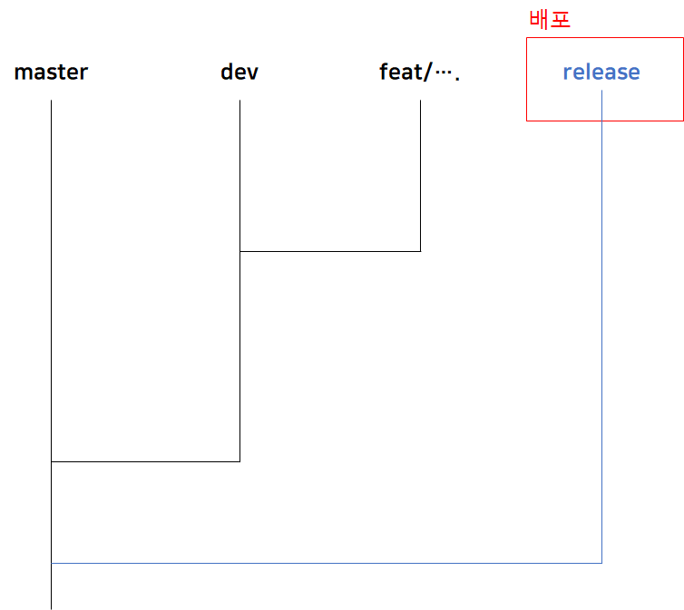

# Commit Convention

```
type: commit log 
```

> [Udacity Nanodegree Style Guide](https://udacity.github.io/git-styleguide/)

### **Type**

- **feat:** A new feature
- **fix:** A bug fix
- **docs:** Changes to documentation
- **style:** Formatting, missing semi colons, etc; no code change
- **refactor:** Refactoring production code
- **test:** Adding tests, refactoring test; no production code change
- **chore:** Updating build tasks, package manager configs, etc; no production code change

### 규칙

- 제목의 길이는 50글자를 넘기지 않는다
- 제목의 마지막에 마침표를 사용하지 않는다
- 본문을 작성할 때 한 줄에 72글자 넘기지 않는다
- 마침표를 사용하지 않는다
- 과거형을 사용하지 않는다
- 커밋 메시지는 **영어**로 작성한다

# Jira Convention

- Epic > Story > Task > Sub-Task

### Epic

: 기능분류? 단계분류?

- 기획/설계
- 개발기초 - 자동화 준비, FE/BE 구조, Web에 Unity 올리기
- 회원관리 - CRUD, 사진 업데이트, 닉네임 중복
- 게시판기능 - CRUD, 좋아요, 개인 화면
- 개인캐릭터설정 - 에셋 조사, 적용, DB 확인
- 캐릭터&맵 - 에셋(동물), 인칭, 무빙, 이동가능 범주, 채팅 ....
- 미션 - Sort, Filter, Tab
- 도감 - 정보 양식, 뱃지, **한국**, ....
- 비회원서비스 - 설문조사 및 결과 공유
- 산출물
    - 1주차 : 기획, 컨셉
    - 2주차 : 계획서, 컨벤션, 아키텍쳐, 요구사항 명세서, 디자인, ERD, 와이어프레임
    - 3주차 : rest api, meta-data
    - 4주차 :
    - 5주차 : UCC, 테스팅, 포팅 메뉴얼, 시나리오
    - 6주차 : 최종 발표 자료

### 이슈관리

- To Do/In Progress/Done 잘 찍기
- Story Point : 담당자가 작성하되 여유롭게 시간을 작성해서 진행하기

## Branch


